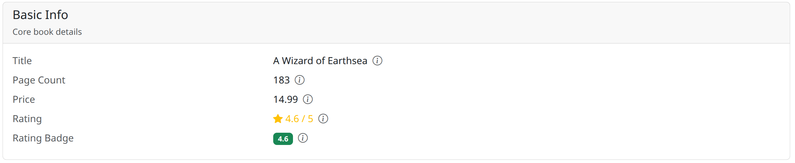
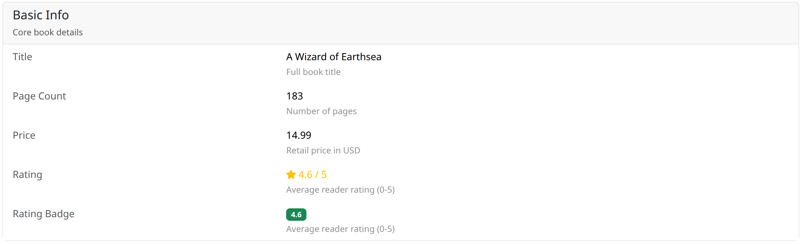

# django-object-detail

Display Django model instances in grouped, Bootstrap 5 layouts with a declarative configuration.

Define which fields to show, how to group them, and pick a layout — `django-object-detail` handles type detection, value resolution (including FK/M2M traversal), and rendering.

## Screenshots

<!-- TODO: Add actual screenshots from the example project -->

### Split Card (default)

Group title on the left, properties on the right inside a card.


### Accordion

Each group is a collapsible accordion panel.


### Tabs (vertical)

Groups as vertical tabs with properties in the tab content area.


### Card Rows

Each group rendered as a standalone card with stacked property rows.



### Striped Rows

Alternating row backgrounds for easy scanning.


### Table Inline

Classic table layout with label and value columns.



### List Group (3-col)

Three-column list group with label, value, and detail.


## Quick Start

Install the package:

```bash
pip install django-object-detail
```

Add it to `INSTALLED_APPS`:

```python
INSTALLED_APPS = [
    # ...
    "django_object_detail",
]
```

Use the mixin in your view:

```python
from django.views.generic import DetailView
from django_object_detail.views import ObjectDetailMixin

class BookDetailView(ObjectDetailMixin, DetailView):
    model = Book
    property_display = [
        {
            "title": "Basic Info",
            "properties": ["title", "author", "isbn"],
        },
        {
            "title": "Details",
            "properties": ["published_date", "page_count", "is_available"],
        },
    ]
```

Render it in your template:

```html



```

That's it — fields are auto-detected, labels are derived from `verbose_name`, and the default `split-card` layout is applied.

## Configuration

### Property paths

Properties are referenced by field name. Use `__` to traverse relationships:

```python
"properties": [
    "title",                    # simple field
    "author__name",             # FK traversal
    "author__country__code",    # multi-hop FK
    "tags",                     # M2M (renders all related objects)
    "get_absolute_url",         # method or property
]
```

### The `x()` helper

For more control over individual properties, use the `x()` shorthand to build a `PropertyConfig`:

```python
from django_object_detail import x

"properties": [
    "title",
    x("author__name", title="Writer"),
    x("published_date", detail="When the book was first published"),
    x("rating", type="integer"),
    x("notes", template="myapp/custom_notes.html"),
]
```

| Parameter  | Description |
|------------|-------------|
| `path`     | Field name or `__`-separated path (required) |
| `title`    | Override the auto-derived label |
| `detail`   | Help text shown below the value |
| `type`     | Override the auto-detected type (e.g. `"date"`, `"boolean"`) |
| `template` | Path to a custom template for rendering the value |
| `link`     | `LinkConfig` or URL name string (see below) |
| `badge`    | `BadgeConfig` or color string (see below) |

### Links

Make a property value a clickable link using `LinkConfig` or a URL name string shorthand:

```python
from django_object_detail import x, LinkConfig

"properties": [
    # String shorthand — reverses URL with the related object's pk
    x("author", link="author-detail"),

    # Explicit args
    x("author", link=LinkConfig(url="author-detail", args=["pk"])),

    # Explicit kwargs
    x("author", link=LinkConfig(url="author-detail", kwargs={"slug": "slug"})),
]
```

The `args` and `kwargs` values are attribute names looked up on the resolved value.

### Badges

Render a property as a Bootstrap badge using `BadgeConfig` or a color string shorthand:

```python
from django_object_detail import x, BadgeConfig

"properties": [
    # String shorthand — fixed color
    x("status", badge="primary"),

    # Color map — value-dependent color
    x("status", badge=BadgeConfig(
        color_map={"active": "success", "inactive": "secondary"},
    )),

    # Color function — dynamic color
    x("priority", badge=BadgeConfig(
        color_fn=lambda v: "danger" if v > 8 else "warning",
    )),

    # Label map — display a different label than the raw value
    x("status", badge=BadgeConfig(
        color_map={"A": "success", "I": "secondary"},
        label_map={"A": "Active", "I": "Inactive"},
    )),

    # Pill badge
    x("category", badge=BadgeConfig(color="info", pill=True)),
]
```

| Parameter   | Description |
|-------------|-------------|
| `color`     | Fixed Bootstrap color name (e.g. `"primary"`, `"danger"`) |
| `color_map` | `dict` mapping values to color names |
| `color_fn`  | Callable that receives the value and returns a color name |
| `label_map` | `dict` mapping values to display labels |
| `pill`      | `True` to use rounded-pill style |

### Groups

Each entry in `property_display` is a group with a title and a list of properties:

```python
property_display = [
    {
        "title": "Basic Info",
        "description": "Core book metadata",
        "icon": "bi bi-book",
        "properties": [
            "title",
            "author__name",
            x("isbn", detail="International Standard Book Number"),
        ],
    },
]
```

| Parameter     | Description |
|---------------|-------------|
| `title`       | Group heading (required) |
| `description` | Subtitle or help text |
| `icon`        | CSS class for an icon (e.g. Bootstrap Icons) |
| `properties`  | List of strings, dicts, or `PropertyConfig` objects |

Properties can be mixed freely — plain strings, dicts with `PropertyConfig` fields, or `x()` / `PropertyConfig` instances.

## Layout Packs

Seven layout packs are included:

| Pack | Setting value |
|------|---------------|
| Split card (default) | `"split-card"` |
| Accordion | `"accordion"` |
| Tabs (vertical) | `"tabs-vertical"` |
| Card rows | `"card-rows"` |
| Striped rows | `"striped-rows"` |
| Table inline | `"table-inline"` |
| List group (3-col) | `"list-group-3col"` |

Set the layout in your Django settings:

```python
OBJECT_DETAIL_TEMPLATE_PACK_LAYOUT = "accordion"
```

## Settings Reference

| Setting | Default | Description |
|---------|---------|-------------|
| `OBJECT_DETAIL_TEMPLATE_PACK_LAYOUT` | `"split-card"` | Which layout pack to use for group/property structure |
| `OBJECT_DETAIL_TEMPLATE_PACK_TYPES` | `"default"` | Which type template pack to use for value rendering |

## Supported Field Types

The following Django fields are auto-detected and rendered with type-specific templates:

| Django field | Detected type |
|--------------|---------------|
| `CharField`, `SlugField`, `URLField`, `EmailField` | `char` |
| `TextField` | `text` |
| `BooleanField`, `NullBooleanField` | `boolean` |
| `DateTimeField` | `datetime` |
| `DateField` | `date` |
| `IntegerField`, `SmallIntegerField`, `BigIntegerField`, `PositiveIntegerField`, `PositiveSmallIntegerField`, `PositiveBigIntegerField`, `AutoField`, `BigAutoField`, `SmallAutoField` | `integer` |
| `FloatField`, `DecimalField` | `float` |
| `ForeignKey`, `OneToOneField`, `OneToOneRel` | `foreignkey` |
| `ManyToManyField`, `ManyToManyRel`, `ManyToOneRel` | `manytomany` |

Methods, properties, and unrecognised fields fall back to the `default` type.
