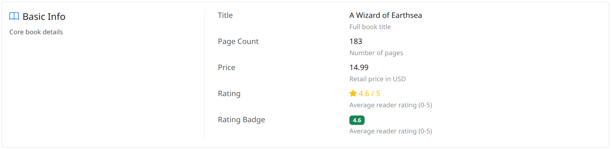
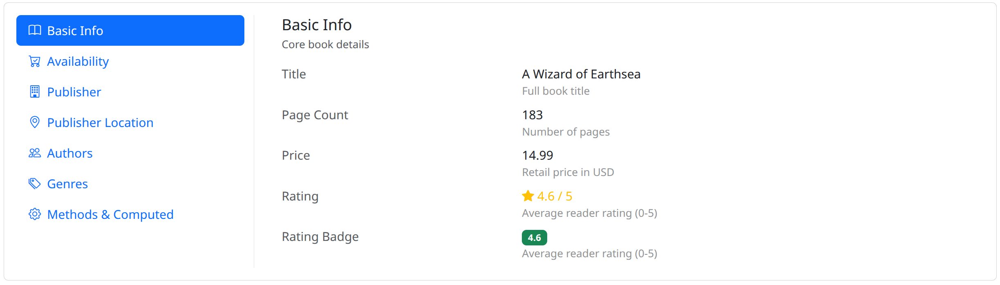

# django-object-detail


Display Django model instances in grouped, Bootstrap 5 layouts with a declarative configuration.

Define which fields to show, how to group them, and pick a layout — `django-object-detail` handles type detection, value resolution (including FK/M2M traversal), and rendering.

## Screenshots

<!-- TODO: Add actual screenshots from the example project -->

### Split Card (default)



### Accordion


### Tabs (vertical)



## Quick Start

Install the package:

```bash
pip install django-object-detail
```

Add it to `INSTALLED_APPS`:

```python
INSTALLED_APPS = [
    # ...
    "django_object_detail",
]
```

Use the mixin in your view:

```python
from django.views.generic import DetailView
from django_object_detail.views import ObjectDetailMixin

class BookDetailView(ObjectDetailMixin, DetailView):
    model = Book
    property_display = [
        {
            "title": "Basic Info",
            "properties": ["title", "author", "isbn"],
        },
        {
            "title": "Details",
            "properties": ["published_date", "page_count", "is_available"],
        },
    ]
```

Render it in your template:

```html



```

## Documentation

Full documentation is available at [Read the Docs](https://django-object-detail.readthedocs.io/).
